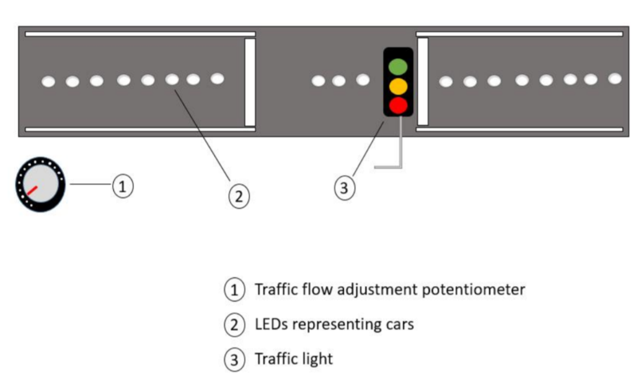

# Real Time Traffic Controller 
ECE455 Lab 1

Designing a traffic light controller for a 1-way street using FreeRTOS on an STM32F4 Discovery board.

## Project Description and Specifications

The traffic light system:

1. Potentiometer: Can be adjusted by the user to change the value of resistance flowing through the circuit. A low value of resistance corresponds to light traffic flow, and a high value of resistance corresponds to heavy traffic flow.
2. LEDs represent the current position of the car (a car on the road is signalled by an LED turned on). To be efficient with GPIO usage on the STM32F4 discovery board, shift registers will be used.
3. Traffic lights are represented by three LEDS: red, yellow, and green. 
